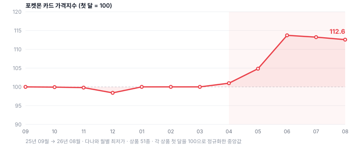

# Olbox — Group Buying × Probability

**Task 1 · Culture-Signal-Based Problem Definition and Product Planning**
Yeonjun Kim · August 2026 · Live build: https://albox-alwayz.vercel.app

---

## 0. Summary

| | |
|---|---|
| **Culture signal** | The Pokémon card boom, and specifically **오리파 (oripa)** — shop-assembled mystery packs. 2026 is the franchise's 30th anniversary. |
| **The pain, precisely stated** | Collectors know exactly which card they want. The probability of pulling it is vanishingly small. That gap — not low odds in the abstract — is what pushed demand into a premium resale market. |
| **Who feels it hardest** | Parents in their 30s–40s: the people paying, while standing outside the culture that sets prices and vocabulary. |
| **Product** | **Olbox — group buying × probability.** Pool the purchase across people instead of across your own wallet. Sampling without replacement then raises the odds *for free*, and trading converts a team's luck into your card. |
| **The one rule** | Every format computes probability the same way: **stock ÷ slots**. No company-chosen multiplier exists anywhere on the probability path, and a test enforces that. |
| **MVP** | Format ① built end-to-end (team draw · full box disclosure · non-replacement updating · all-ready gate · TTC trading), formats ②③ as verified engines with screens. |

---

## 1. Culture Signal

**Signal: the Pokémon card boom — and inside it, oripa.**

Oripa (オリパ, "original pack") are mystery packs that a card shop assembles itself: the shop decides the contents and the odds. Unlike official booster packs, nothing about that decision is externally constrained.

### Evidence it was genuinely a topic

| # | Claim | Figure | Source |
|---|---|---|---|
| A1 | KREAM TCG transaction value surged | **+5,625%** YoY, Jan–Apr 2026 | Maeil Shinmun, 2026-08-18 |
| A2 | Single-month peak | **+15,325%** in April alone | Maeil Shinmun, 2026-08-18 |
| A3 | Offline queues | **600+ people** before opening at the Yongsan IPark Mall card shop on release day; **2,000 visitors** that day | Hankyung, 2026-04-30 |
| A5 | Timing | **2026 = 30th anniversary** of Pokémon | Maeil Shinmun · Hankyung |
| A6 | Buyer base | Primary buyers are in their **20s–40s**; the generation that consumed the content as children now has purchasing power, and that is cited as the main driver of market expansion | Hankyung, 2026-04-30 |
| A7 | Supply | Mart toy sections sell out the day stock arrives; popular items in 30 minutes | Hankyung, 2026-04-30 |

### Evidence we produced ourselves — 1. The price move, in our own data

Press coverage reports the boom. We wanted to see it in prices we collected ourselves, over exactly the window the brief asks about — the last year.

We pulled **12 months of monthly low prices (2025-09 → 2026-08) for 51 Pokémon-card products** from a Korean price-comparison marketplace. Each product is normalised to 100 at its own first month, and we take the **median** across products, so that one expensive card cannot drag the series.



> **The index runs 100.0 → 112.6. 34 of 51 products (66.7%) ended higher, median change +12.6%.**
> The series is flat for seven months, then turns: **the first month the index rises above 100 and stays there is 2026-04.**

That date is not one we chose. The chart script derives it from the series. It matters because **three independent sources point at the same window**:

| Source | What it says | Window |
|---|---|---|
| KREAM transaction value (press) | +15,325% in a single month | **2026-04** |
| Pokémon 30th-anniversary event, Seongsu-dong, Seoul (press) | Halted by the crowd; police and fire dispatched | **2026-05-01** |
| **Our price index** (own crawl) | Turns upward and holds | **2026-04** |

Two of these are reported; one is ours, collected without reference to the other two. They agree.

> **Stated limits.** These are marketplace *listing* low prices, not completed-transaction prices, and the 51 products are those with a stable product code on this one marketplace — not a representative sample of the Korean card market. The median is robust to outliers but the tail is extreme: the largest single rise we measured is **+2,048%** (5,500 → 118,150 KRW). We report the median, not that number, as the headline.

### Evidence we produced ourselves — 2. What is broken inside it

A price rise is not a problem statement. Press coverage does not establish *what is broken inside the boom*. So we measured that directly: we crawled a Korean price-comparison marketplace, identified every oripa listing, and audited how each one describes its odds.

> **Of 37 oripa listings, the number that state a probability is 0.**
> Of the same 37, **30 (81.1%)** advertise a *guarantee* — "SAR guaranteed", "3 RR cards guaranteed", "high return rate".

**They sell guarantees instead of probabilities.** A guarantee is not a falsifiable claim about a distribution; it is a floor. You cannot use it to compute what you are buying.

> **Stated limits of this measurement.** This is a *listing-text* audit, not a *seller-page* audit. 36 of the 37 listings are brokered links whose bridge page hands off the destination in JavaScript, so we could not reach the seller's own page statically. The one reachable page was checked and contained no odds statement. **We did not count "unreachable" as "undisclosed."** The claim this supports is "no odds appear in the listing or its specs," not "the seller discloses odds nowhere."

---

## 2. Analysis: Why Now, and What Is Actually Missing

### 2.1 Why now

**Price infrastructure reclassified cards from play into assets.** The fact that TCG now trades on KREAM — a platform built for sneakers and luxury resale — *is* the reclassification. Once a secondary market quotes a card continuously, the card has a price, and a price makes it an asset.

**When the amount at stake grew, the cost of failure grew with it.** Mis-buying a ₩1,000 booster pack and mis-buying a ₩50,000 oripa are not the same event.

**And the 30th anniversary brought back a cohort with money.** The people who collected these cards as children are now in their 30s and 40s.

### 2.2 The deficit, stated precisely

It is tempting to say the problem is "the odds are bad." That is not the problem. Low odds are a known, accepted property of collectible packs.

The actual deficit is a **mismatch between a specific want and a random supply**:

> **A collector knows exactly which card they want. The probability of pulling that card is vanishingly small. There is no path from wanting it to getting it except paying more.**

This is not speculation about the mechanism — it is what the market did in response. When people cannot reach a specific card through packs, they buy it on the secondary market at a premium instead. **KREAM's +5,625% is not only evidence that the category is hot; it is evidence of this pain being paid for.** The resale market is the workaround people built because the primary mechanism does not deliver what they want.

Two structural facts compound it:

**(a) The box is invisible.** Odds cannot be verified even when stated, because no one can count the numerator (how many hit cards are in the box) or the denominator (how many slots the box has). Disclosure, in this market, is a claim rather than a check. Our own audit found the claim is usually not even made.

**(b) What you don't want is worthless to you and valuable to someone else.** Duplicate cards are the normal outcome of pack opening. Blind-box culture already solved this offline — *"you open boxes until your character comes out, and you trade duplicates in the community."* Trading is not an invention. It is an existing behavior that lives in card shops and community chat rooms, and nowhere inside a commerce app.

### 2.3 Who feels it hardest, and why

**Parents in their 30s and 40s.** They are the ones paying, and they are outside the culture.

A card shop is a space for children and professional resellers. Someone who does not know what SAR, PSA, or oripa mean walks into a pricing conversation they cannot audit. They cannot tell an ordinary card from a valuable one, cannot tell a fair price from a marked-up one, and cannot tell whether the mystery pack they just bought was ever going to contain anything.

For a collector who is inside the culture, low odds are a known cost of play. For a parent, they are an unpriced risk on a purchase made for someone else.

> **This targeting is an inference, and we mark it as one.** The published evidence (A6) supports "primary buyers are 20s–40s, and 30s–40s purchasing power drove expansion." The further claim — that the payer-outside-the-culture feels this most acutely — is our reading, not a measured finding. We did not run interviews or a survey.

### 2.4 What the literature says

Three questions, answered from published work rather than from our own conviction.

**(a) Why does a resale market form at all? Because value is extremely concentrated.**

Heck et al. (*PLoS One*, 2026) is the closest published study to our subject: they listed **300 Pokémon cards on eBay for one year** and recorded what actually sold.

> "**Remarkably, while Rare cards accounted for only 19.1% (42/220) of all cards sold, they contributed 58.8% (543.45 €/923.60 €) to the total revenue.**"
> Median sale price was **1.95 €**; the distribution is "markedly skewed." By rarity the medians were Rare **9.48 €**, Uncommon 1.95 €, Common 1.50 €.

This is the mechanism behind the problem in §2.2, measured rather than asserted. When roughly a fifth of the cards carry three-fifths of the value, a buyer who wants one specific high-grade card cannot get there by buying packs at a sensible cost — and a secondary market at a premium becomes the rational route. The same paper notes that "dependence on the thrill of pulling rare cards from booster packs share[s] characteristics with gambling and addictive behaviors."

**(b) Why do people engage with probability mechanics? Socially first — and knowingly in the dark.**

Culbong et al. (*Journal of Youth Studies*, 2026) interviewed Australians aged 18–24 about loot boxes and gacha.

> "**We found that initial reasons to engage with gambling features were largely social**, as well as the desire to improve the gaming experience." Continued engagement was "strongly associated with social and psychological rewards."
> "The rarity of the outputs, or 'rewards', was **directly positively associated with the level of excitement** participants experienced."

Two of their findings matter to us more than the rest, because they match what our own crawl found, from a completely different direction:

> "**The loot box mechanics do not explicitly display the odds for each item, but the players were aware that the odds are extremely low for rare items.**"
> New players are drawn in by a "rookie banner… a gambling mechanic **with a guaranteed rare item**."

Their qualitative interviews in Australia and our listing audit in Korea describe the same two-part pattern: **odds are not shown, and a guarantee is offered in their place.** Our measurement of it is B7 — of 37 oripa listings, **0 state a probability and 30 (81.1%) advertise a guarantee.** We did not go looking for this correspondence; we found the paper after the crawl.

**(c) What the literature says against us.**

We treat two of the five sources as warnings about our own design rather than as support for it, and we say so because each one is easy to misuse in the other direction.

- **Randomising *who gets paid* makes people less risk-averse.** Baltussen et al. (*Experimental Economics*, 2012) find that "between-subjects randomization reduces risk aversion" — when only some participants are selected to receive a real payment, people take more risk. The authors report this as an *experimental-design bias*, not as consumer psychology. **It is not a gacha study, and we do not cite it as one.** We cite it because Olbox formats ② and ③ pay only some of the participants, which is structurally the same shape. It is a reason for caution about those two formats, not a reason for confidence.
- **Social reward is the strongest predictor of problematic use.** Wadsley et al. (*Psychological Reports*, 2022) found that a 'social reward' factor — impression management, social comparison, FoMO — was "the strongest predictor" of both checking frequency and problematic use. **This is a study of social networking sites, not of cards or gacha**, so it transfers only as a caution. But the caution lands squarely on us: Olbox format ① *runs on* social reward. That is why team size is capped at 10, why there is no invite bonus, no streak, and no pity counter. The mechanism the paper identifies as the risk factor is the mechanism our product uses.

And the three findings we already carried:

- **Uncertainty depresses purchase intention; autonomy raises it.** (*Current Issues in Tourism*, 2025) → randomness alone is not a product. People must be able to choose something.
- **The gambler's fallacy and immediate gratification mediate irrational consumption; perceived scarcity moderates it.** (Xia et al., *BMC Psychology*, 2025) → publish the non-replacement mechanics; never use scarcity as pressure.
- **Loot-box spending correlates with problem gambling at r = 0.26 (0.37 after trim-and-fill), meta-analysis of 15 studies.** (Garea et al., *International Gambling Studies*, 2021) → the magnitude of harm is documented; a losing outcome must not exist.

> **We also cite what cuts against us.** Zhang & Zhang (2022) find uncertainty *raises* purchase intention. **We adopted the unfavorable finding**, because it yields an actionable design constraint (add autonomy) rather than a permission slip. Both studies use Chinese consumer samples; applying them to Korea is an assumption. The r = 0.26 figure is cross-sectional and its authors do not claim causation. Heck et al. sampled the German eBay market, and Culbong et al. interviewed 18–24-year-old Australians — neither is a Korean sample, and we mark that as a limit rather than smoothing over it.

---

## 3. Product: Olbox

### 3.1 The idea in one line

> **Olbox is group buying fused with probabilistic purchase.**

The conventional way to improve your odds is to buy more packs yourself. That is not a mechanism; it is just spending. **Olbox routes the bulk purchase through a group instead of through one wallet** — and then the mathematics of drawing without replacement hands the group a genuine improvement, at no cost to anyone.

Concretely: if a box has 1,000 slots and exactly one top-grade card, one person has a 0.100% chance. Ten people drawing from the same box have a **1.000%** chance that the card appears in the team — **exactly ten times**, because

```
                     C(N − K, n)                                    n
P_team(g, n) = 1 −  ─────────────      and when K = 1 this is      ───
                       C(N, n)                                      N
```

This is the hypergeometric distribution. It is not a marketing multiplier and not a number anyone at the company chose — it follows from the definition of sampling without replacement. When the stock is 4 rather than 1, the factor is **9.87×**, not 10×, and the product displays 9.87× rather than rounding.

### 3.2 Three formats, one rule

Olbox is not a single item. It is a combination — group buying × probability — and that combination admits variations. Every one of them computes probability the same way.

> **Probability = stock ÷ slots.**

| Format | Numerator (stock) | Denominator (slots) | Effect of more people |
|---|---|---|---|
| **① Team draw** | grade stock `K` (S 1 / A 4 / B 25 / C 970) | box slots `N` = 1,000 | **Rises.** Hypergeometric; `K=1` gives exactly n× |
| **② Brand-collab group buy** | refund slots `R(M)` | participants `M` | **Rises.** Fixed campaign cost amortizes across more people |
| **③ Zero-cost deal raffle** | deal slots `W` | entrants `E` | **Falls.** A fixed allocation split among more people |

Formats ② and ③ derive their *stock* from a budget — but never their *probability*. Probability remains a division, and the stock is a countable number displayed on screen. A test asserts the identity `probability × slots = stock` across the entire domain of each format; if a budget parameter ever touched the odds, that identity would break.

**This is the distinction that the first version of this product failed.** An earlier build derived a probability *multiplier* from budget (bulk-purchase cost savings, customer-acquisition recovery) and multiplied it into a stock-based probability. The result was a box with 1,000 slots showing 0.280% — an expected yield of 2.8 copies of an item whose stock was 1. The contradiction survived 5,631 passing self-checks, because the checks verified the arithmetic rather than the model.

### 3.3 The structural proof that the team effect is real

Format ③ is the control. It uses the same rule and moves the opposite way.

```
①  Team draw        more people → probability RISES     (10 people = exactly 10×)
③  Deal raffle      more people → probability FALLS     (50 entrants 30.00% → 2,000 entrants 0.75%)
```

Same formula. Opposite direction. The difference is structural: **a team shares one box, so more draws from the same box means more chances for the group; a raffle splits a fixed allocation, so more entrants means a thinner slice.**

This is why "get your friends and your odds go up" is not a slogan here. It is a property of a specific structure, and we show the counterexample on screen rather than hiding it.

### 3.4 Core features

**① Full box disclosure.** Every card in the box is shown with its real name, market price, and photo, taken from crawled marketplace data. The odds are not a number we write down; they are the stock divided by the slots, and you can count both.
*Addresses: deficit (a) — the invisible box.*

**② Drawing without replacement, with live updating.** A drawn card leaves the box and the remaining odds rise, visibly. "It hasn't come out, so it's due" is a fallacy under replacement and **true** under non-replacement. Because of this, no artificial pity timer exists — the shrinking box *is* the pity mechanism, and it proves itself in the displayed number.
*Addresses: the gambler's-fallacy finding — make the intuition true rather than exploiting it.*

**③ Targeting a specific card.** Before opening, each participant names the one card they want. This does not change any probability; it becomes their first preference in the trade.
*Addresses: the autonomy finding — randomness alone depresses intent.*

**④ Trading, via Gale's Top Trading Cycles.** After the box opens, the team trades. The algorithm guarantees four properties: a core allocation exists, the result is Pareto-efficient, **no one ends up worse than before the trade** (individual rationality), and **misreporting your preferences cannot help you** (strategy-proofness).

**Trading is the load-bearing feature, not a nicety.** Without it, a bigger team raises the probability that *someone* gets the card and leaves your personal odds at `K/N`. The team effect exists but never reaches you. Trading is the mechanism that converts a team's probability into your card — and therefore the mechanism that actually answers "I know which card I want."

### 3.5 No losing outcome, in two layers

| Layer | Guarantee | Kind |
|---|---|---|
| 1 | The cheapest card in the lowest grade still costs more than the entry fee | **Data invariant**, checked against crawled prices |
| 2 | After trading, no participant is worse off than before | **Theorem** (Roth & Postlewaite, 1977) |

Layer 2 is what makes layer 1 affordable. Supporting "you cannot lose" on layer 1 alone requires a large supply of items priced near the entry fee — and an earlier version of this product could not find those among cards, so it mixed in household goods. The result was a Pokémon card box that dispensed sesame oil, and the culture signal and the product stopped matching. With layer 2 carrying part of the load, layer 1 only needs "at or above entry price," which the card market supplies on its own.

**What the no-loss floor does to the value distribution — measured against the literature.** §2.4(a) gave us a published benchmark for how concentrated card value really is: in Heck et al.'s year-long field study, the **top 19.1% of cards sold carried 58.8% of revenue.** We can ask the same question of our box at the identical cut point.

| | Top 19.1% of items | Share of total value |
|---|---|---|
| Real market (Heck et al., 2026) | Rare cards sold | **58.8%** |
| **Olbox** (`node api/_box.js`) | Top 191 of 1,000 slots by price | **34.1%** |

**Value in our box is 1.73× less concentrated than in the market the paper measured.** That is not a marketing choice; it is a direct consequence of layer 1. Requiring every slot to be worth at least the entry fee raises the floor, and raising the floor is arithmetically the same thing as flattening the distribution. The box is less top-heavy than the market it is drawn from — which is the entire point, and it is checkable from the repository.

### 3.6 Why Alwayz specifically

Alwayz already runs **team buying** as core grammar — 팀구매, 다인딜, 0원딜. Users there have already learned that gathering people changes the price.

Olbox adds probability on top of that same gesture. It reads as an extension of a mechanic the user already knows, not as a new concept to be taught. **A competing marketplace would have to build team buying first.** The aggregation structure is the prerequisite, and it already exists here — including the placement: the floating center tab in the bottom navigation.

---

## 4. MVP

### 4.1 Hypothesis

> **H1 — The ability to trade lowers the barrier to probabilistic purchase.**

Rationale: autonomy raises purchase intention (D2); the documented harm is in losing outcomes (D6); trading is an existing community behavior (E4). If trading removes "I paid and got something useless," the first purchase becomes a smaller decision.

### 4.2 Minimum configuration

Format ① end-to-end: **disclose the box → gather a team → target a card → all-ready gate → open → one trading round → side-by-side comparison against oripa.** Formats ② and ③ ship as verified engines with screens, because the product claim is about the *combination*, and a single format cannot demonstrate a combination.

**Excluded, and why:** payment and shipping (irrelevant to the hypothesis); a pity timer (non-replacement already does the job, and adding a tunable parameter would break the claim that no company-chosen number exists on the probability path).

### 4.3 What the MVP can and cannot measure

| Metric | In this MVP |
|---|---|
| Conversion difference between trade-exposed and trade-hidden cohorts | **Not measurable** — no live users |
| Targeting completion rate, post-trade satisfaction | **Not measurable** — same reason |
| **Trade conversion**: how often a team's find becomes *your* card | **Measured** — 100,000-run simulation |
| **Share of participants improved by trading** | **Measured** — same |

**Stated plainly: the MVP does not test H1.** It measures how much trading actually converts team probability into personal probability. Whether that lowers a real person's barrier to entry requires real users.

### 4.4 What the measurement found

Simulating the trade produced a result that changed the design.

| Preference model | A teammate's top card reaches me | Participants improved | Trade cycles per round |
|---|---|---|---|
| **Divergent** — everyone wants something different | **51.9%** | **68.4%** | 2.54 |
| **Identical** — everyone ranks the same way | 1.9% | 10.5% | 0.51 |

Top Trading Cycles only forms a cycle when preferences cross. If every participant wants the same things in the same order, there is mathematically nothing to trade. The first design filled unstated preferences by descending market price — which made every participant's ranking identical below their targeted card, and **quietly disabled the product's central mechanism.**

This is why targeting and the conversational AI that builds each person's ranking are load-bearing rather than decorative: **they are what makes preferences diverge.** Both numbers are shown on screen; we do not display only the favorable column.

### 4.5 Why we believe this solves the stated problem

The problem was: *a collector knows which card they want, and cannot reach it.*

1. **Full disclosure** turns the odds from a claim into a countable fact — you can see whether the card you want is even in the box, and how many of it there are.
2. **The team** raises the probability that the specific card appears, by exactly the number of participants when its stock is one — with no number chosen by us.
3. **Trading** routes that card to the person who named it. This is the step that converts "the team got it" into "I got it," and without it the first two steps do not reach the individual.
4. **Two-layer no-loss** removes the downside that made the purchase a risk for a payer outside the culture.

The honest boundary: this makes the *primary* mechanism deliver a wanted card far more often than a pack does. It does not make a ₩1.5M card cheap. What it removes is the situation where the only path from wanting a specific card to owning it runs through a premium resale market.

---

## 5. Limits We Are Not Hiding

1. **H1 is not validated.** Only proxy metrics were measured.
2. **The target definition is an inference,** supported by published buyer-demographic data only up to "20s–40s."
3. **Box cost is modeled at retail price.** Crawled prices are retail; actual procurement cost is not modeled. The box's total market value therefore exceeds total entry fees, which is a structural consequence of the no-loss floor — **it should not be read as a unit-economics claim.**
4. **Strategy-proofness is sampled, not proven for this implementation.** The theorem is established (Roth, 1982); our check tests 3,000 randomized misreports and finds no gain. That is not exhaustive.
5. **Preference divergence is assumed.** The "divergent" model is a random permutation. How much real collectors' tastes actually diverge — the quantity that determines trading's value — was not measured.
6. **We could not reach oripa sellers' own pages.** 36 of 37 listings are brokered.
7. **Two community-sourced claims** (shops secretly restocking losing cards; the impossibility of verifying that a jackpot card exists) are labeled as community reports, with the institutional-gap claim carried by press coverage instead.
